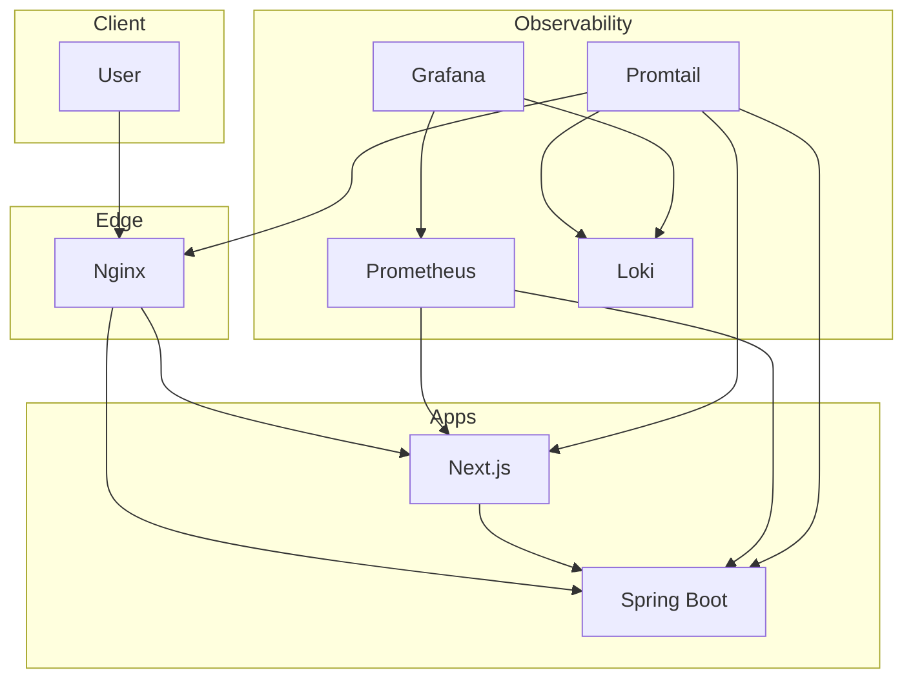

# Observability 관측성 스택

이 저장소는 README에 정의된 관측성 구성을 바로 시작할 수 있도록
`Spring Boot + Next.js + Nginx + Prometheus + Loki + Promtail + Grafana`
기본 아키텍처를 함께 제공한다.

## 구성 요소

- Prometheus
  - Spring Boot의 `/prometheus`, Next.js의 `/api/metrics`를 주기적으로 수집한다.
- Loki
  - 백엔드, 프론트엔드, Nginx 로그를 저장한다.
- Promtail
  - 각 서비스 로그 파일을 읽어 Loki로 전달한다.
- Grafana
  - Prometheus와 Loki를 데이터소스로 자동 등록한다.
- Spring Boot
  - `/health`, `/prometheus`, `/api/platform/status`를 제공한다.
- Next.js
  - `/api/health`, `/api/metrics`, `/api/backend/status` BFF 경로와 기본 대시보드 화면을 제공한다.
- Nginx
  - 외부 진입점 역할을 수행하며 `/`는 프론트엔드로, `/health`와 `/prometheus`는 백엔드로 프록시한다.

## 아키텍처



## 디렉터리 구조

```text
.
|-- backend
|   |-- src/main/java
|   |-- src/main/resources
|   `-- src/test/java
|-- frontend
|   |-- app
|   |-- components
|   |-- services
|   `-- public
|-- infra
|   |-- grafana
|   |-- loki
|   |-- nginx
|   |-- prometheus
|   `-- promtail
|-- logs
`-- docker-compose.yml
```

## 실행 방법

```bash
docker compose up --build
```

## 접속 주소

- 애플리케이션: `http://localhost`
- 프론트엔드 직접 접근: `http://localhost:3000`
- 백엔드 직접 접근: `http://localhost:8080`
- Grafana: `http://localhost:3001`
- Prometheus: `http://localhost:9090`
- Loki: `http://localhost:3100`

## 핵심 엔드포인트

- Backend health: `GET /health`
- Backend metrics: `GET /prometheus`
- Backend status API: `GET /api/platform/status`
- Frontend health: `GET /api/health`
- Frontend metrics: `GET /api/metrics`
- Frontend BFF: `GET /api/backend/status`
